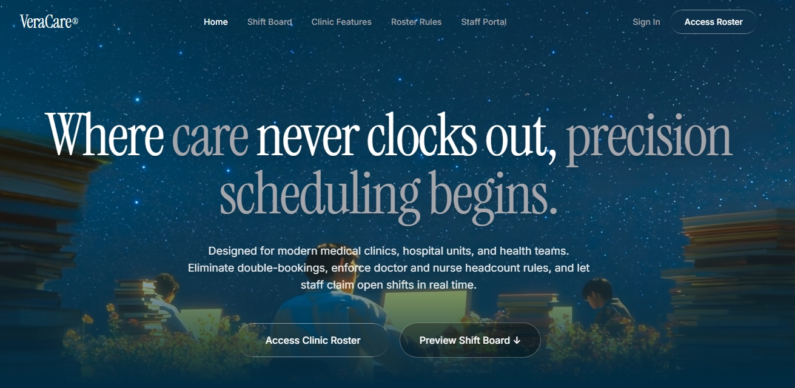
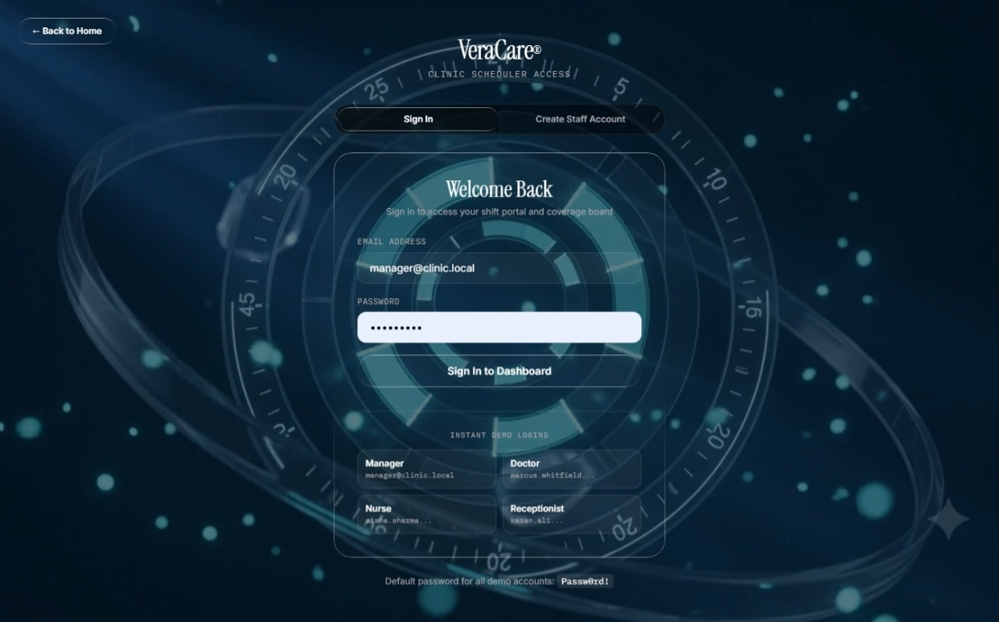
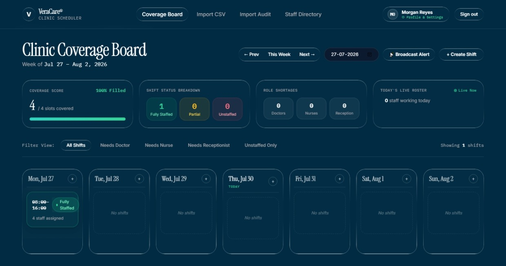
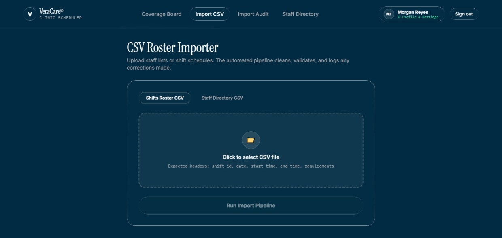
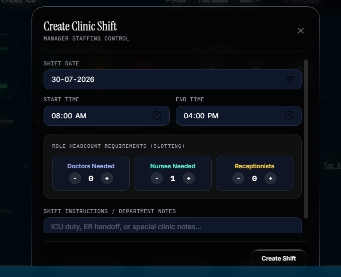
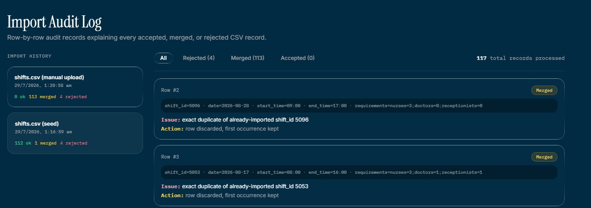
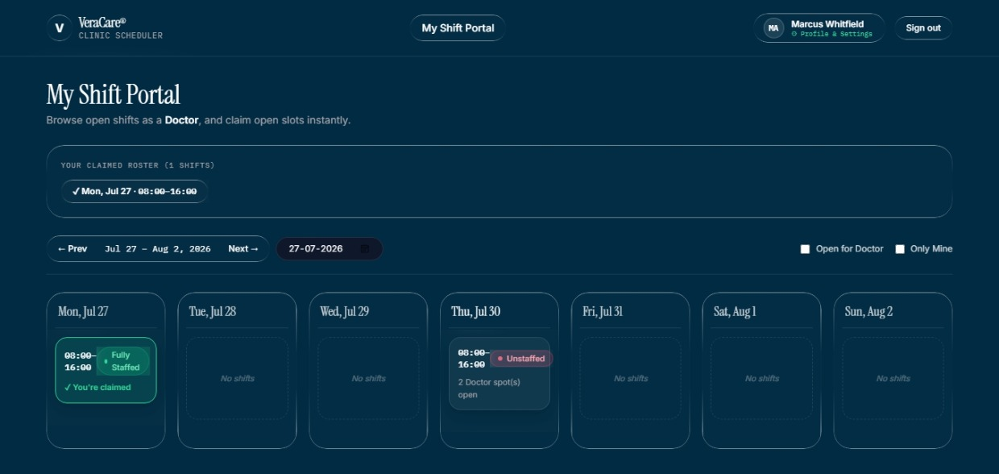
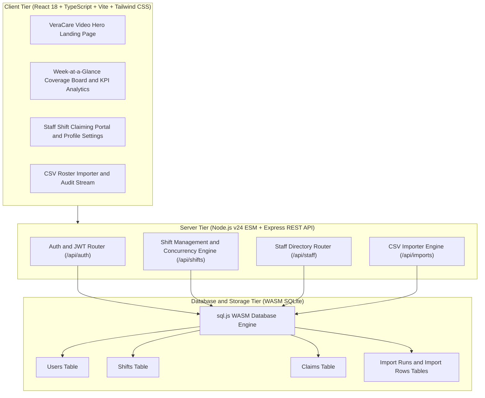
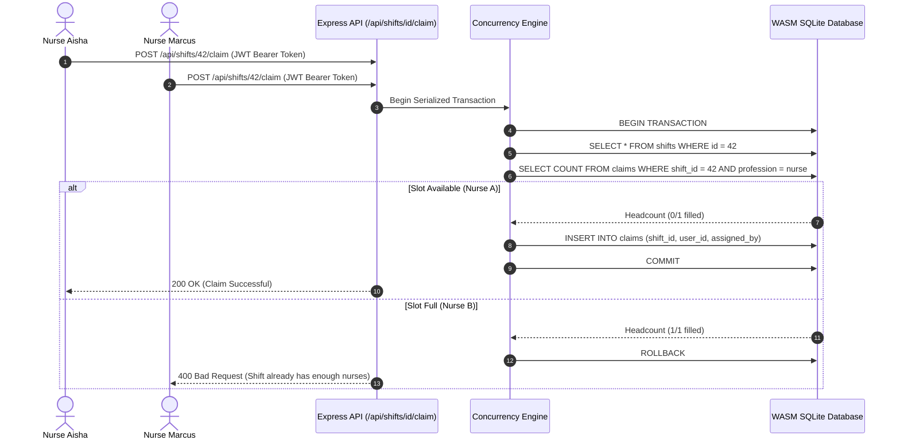
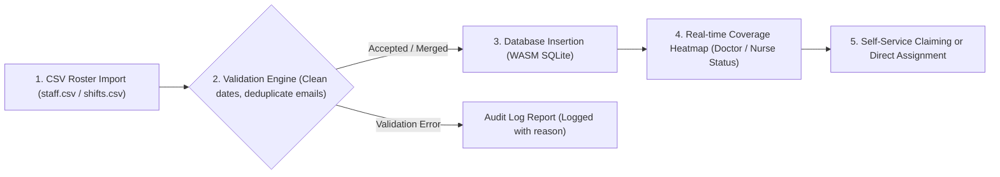

# VeraCare® Clinic Scheduler & 24/7 Roster Platform

[](https://veracare360.onrender.com/)
[](https://nodejs.org/)
[](https://react.dev/)
[](https://www.typescriptlang.org/)
[](https://sql.js.org/)
[]()

> [!IMPORTANT]
> **🚀 Live Production Application**: [https://veracare360.onrender.com/](https://veracare360.onrender.com/)

A high-performance, 24/7 medical staff shift scheduling platform designed for modern clinics, hospital units, and emergency medical teams. Built with a single-page **VeraCare® Video Hero**, glassmorphic navigation, liquid-glass UI controls, and Instrument Serif display typography.

Managers create and allocate shifts with real-time week-at-a-glance coverage heatmaps; medical staff (**Doctors, Nurses, Receptionists**) browse and claim open shift slots with **100% server-side business rule validation** and **serialized transaction concurrency safety**.

---

## 📸 Application Visual Tour & Gallery

### 1. VeraCare® Single-Page Video Hero Landing Page

> **Description**: Fullscreen background video with glassmorphic top navigation, Instrument Serif display typography (`Where care never clocks out, precision scheduling begins.`), liquid-glass buttons, and smooth rise animations.

---

### 2. Week-at-a-Glance Coverage Board & KPI Analytics

> **Description**: Interactive week grid showing real-time doctor, nurse, and receptionist shift coverage, coverage percentage gauge score, filled vs empty shift breakdown, and role shortage counters.

---

### 3. Live On-Duty Roster Widget & Role Shortage Filter

> **Description**: Live widget displaying medical staff working on shift today with pulsing indicators alongside quick role shortage filter buttons (*Needs Doctor*, *Needs Nurse*, *Needs Receptionist*, *Unstaffed Only*).

---

### 4. Shift Slotting & Staff Assignment Control Modal

> **Description**: Manager shift control modal featuring `+` / `-` role headcount slotting controls, shift timing inputs, scrollable staff list, and 1-tap direct doctor/nurse assignment.

---

### 5. Clinic Staff Directory

> **Description**: Searchable directory displaying active doctors, nurses, and receptionists on roster with medical specialty badges and external staff IDs.

---

### 6. CSV Roster Importer Pipeline

> **Description**: Drag-and-drop CSV importer for staff lists and shift schedules with automated date cleaning, email deduplication, and row validation.

---

### 7. Row-by-Row CSV Import Audit Log

> **Description**: Detailed audit trail documenting every accepted, merged, or rejected CSV record with human-readable explanations and action logs.

---

## 🏛️ System Architecture



---

## 🔄 Concurrency & Serialized Shift Claiming Workflow

> [!IMPORTANT]
> When multiple staff members simultaneously attempt to claim an open shift slot, the database executes inside a **synchronous WASM transaction lock**. Exactly the required headcount succeeds, and excess claims fail gracefully with an explicit headcount error.



---

## 📋 3-Step Roster Processing Pipeline



---

## ⭐ Key Feature Highlights

> [!TIP]
> **VeraCare® Single-Page Video Hero**: Fullscreen background video, glassmorphic top navigation bar, `VeraCare®` logo in Instrument Serif display typography, and liquid-glass CTAs.

- **KPI Analytics Gauge**: Real-time week coverage score %, filled vs empty shift breakdown, and doctor/nurse shortage indicators.
- **Live On-Duty Roster Widget**: Displays currently active medical staff on duty right now with live pulsing indicators.
- **Role Shortage Filter Bar**: One-click filter for shifts needing Doctors, Nurses, or Receptionists.
- **Profile & Settings Modal**: Edit name, email, specialty, shift alert notification preferences, and security credentials.
- **Manager Slotting Controls**: Explicit `+` / `-` headcount requirement adjustment and searchable staff assignment list.

---

## 🔑 Demo Access Credentials

> [!NOTE]
> All seeded demo accounts share the password: `Passw0rd!`

| Role | Full Name | Email Address | Password |
|---|---|---|---|
| **Clinic Manager** | Manager Admin | `manager@clinic.local` | `Passw0rd!` |
| **Doctor** | Marcus Whitfield | `marcus.whitfield@clinicmail.test` | `Passw0rd!` |
| **Nurse** | Aisha Sharma | `aisha.sharma@clinicmail.test` | `Passw0rd!` |
| **Receptionist** | Karan Ali | `karan.ali@clinicmail.test` | `Passw0rd!` |

---

## 🚀 Local Development Setup

### 1. Install Dependencies & Seed Roster

```bash
# Install root, server, and client packages
npm install
npm run install:all

# Seed database with staff roster & initial shifts
npm run seed --prefix server
```

### 2. Start Application Servers

```bash
# Launches Express backend (:4000) and Vite dev client (:5173) concurrently
npm run dev
```

Open **http://localhost:5173/** to explore the application.

---

## 🧪 Automated Test Suite

> [!NOTE]
> The automated test suite executes Node built-in test runner (`node --test`) against an isolated temporary SQLite database file.

```bash
npm test --prefix server
```

```text
✔ claiming succeeds when a slot for the profession is open (44.5ms)
✔ claiming is rejected once the profession headcount is met (28.9ms)
✔ claiming is rejected when it overlaps another claimed shift for that person (29.2ms)
✔ non-overlapping back-to-back shifts are both claimable (30.3ms)
✔ overnight shift overlap is detected correctly across midnight (32.1ms)
✔ manager assign follows the same rules as self-claim (28.6ms)
✔ unclaim frees the profession slot back up (48.3ms)
✔ editing a shift time that would create an overlap is flagged as a conflict (32.6ms)
✔ concurrent-style rapid claims never over-fill a shift (serialized correctness) (45.3ms)
✔ parseMessyDate & parseMessyTime validation rules (12.4ms)

ℹ tests 20 | ℹ pass 20 | ℹ fail 0 | duration_ms ~980ms
```

---

## 🐳 Docker Deployment

To build and launch the single production container:

```bash
docker compose up --build
```

Access the deployment live at **http://localhost:4000/**.
